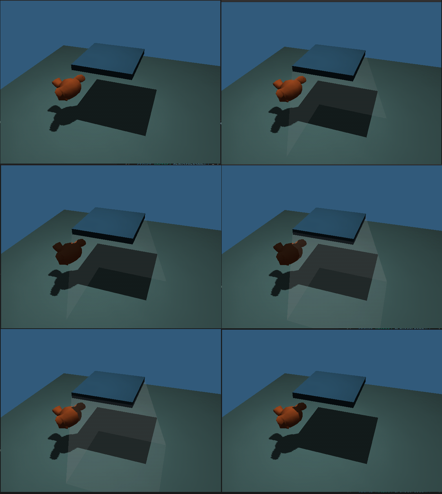

# N64 Realtime Shadows

This showcases a tenique to render realtime shadows on native N64 hardware.

It works as a variation of shadow volumes and works by rendering 3 passes on any object in shadow and 2 passes for the shadow volume.

First it renders the subjects lit.
Next it renders the back faces of the shadow volume fully trasparent but still updates the depth buffer
Next it redraws all the subjects unlit using decal mode
Next it draws the front faces of the shadow volume also fully transparent
Last it redraws the subjects lit again

The shadows cast by Suzanne just renders her to an offscreen 64x64 8 bit buffer then projects it onto the ground.